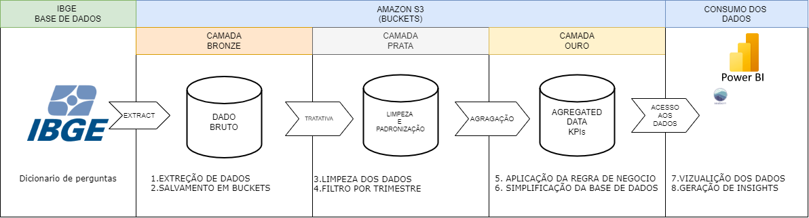
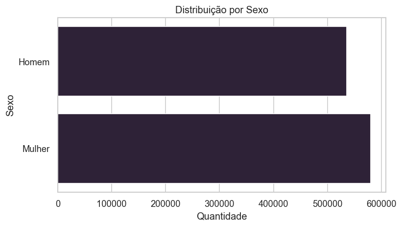
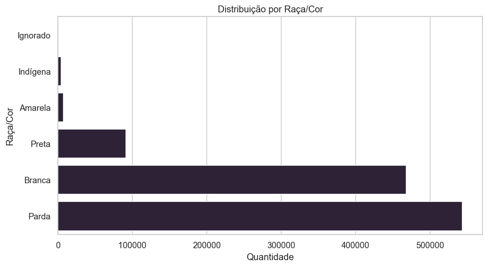
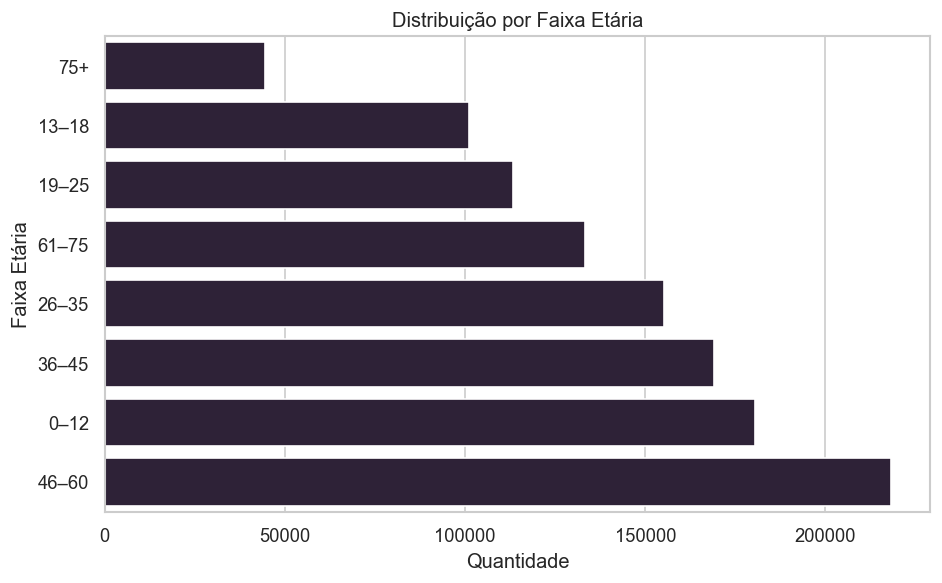
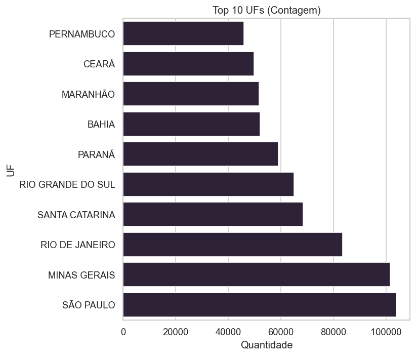
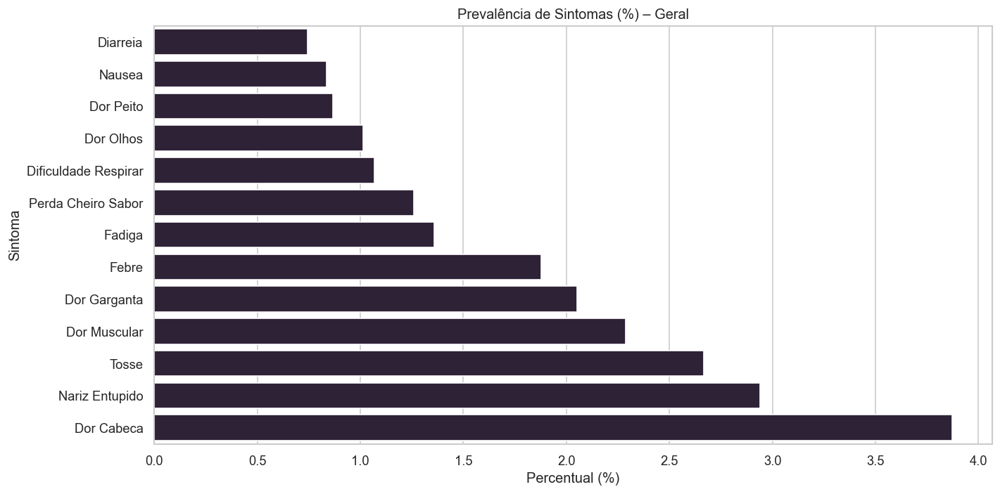
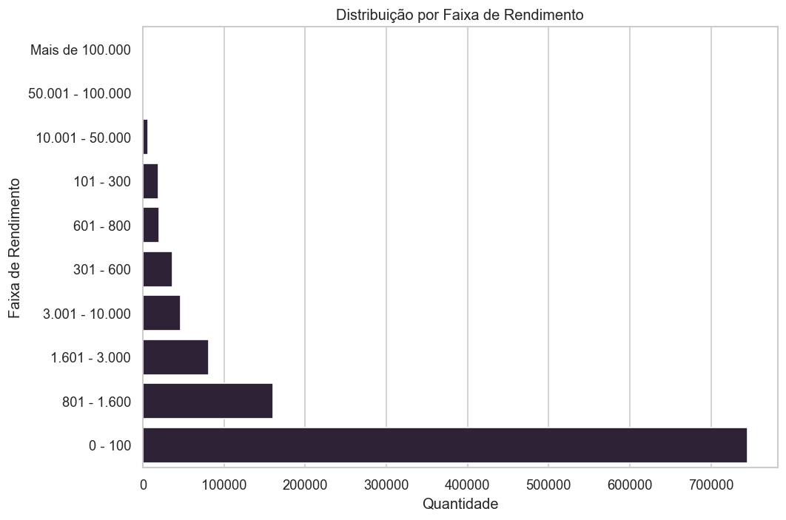
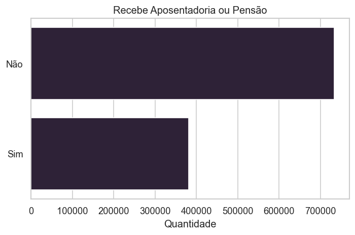

# 📊 Tech Challenge 3 – ETL e Análise do PNAD-COVID 19 (IBGE)

## Contexto

A pandemia da COVID-19 provocou impactos profundos no Brasil — não apenas na saúde pública, mas também na estrutura social e econômica.
O **PNAD-COVID 19**, conduzido pelo IBGE, permitiu monitorar esses efeitos de forma contínua, coletando dados sobre sintomas, trabalho, renda e comportamento da população brasileira durante o período pandêmico.

Este projeto teve como objetivo **estruturar essa base massiva através de um pipeline ETL em nuvem**, transformando os microdados em uma arquitetura analítica escalável e organizada em camadas, para gerar **insights estratégicos e de apoio à gestão hospitalar**.

---

## Problema Proposto

O **Head de Dados** definiu que o projeto deveria se concentrar em **três dimensões principais**:

- **Sintomas clínicos da população**
- **Características demográficas**
- **Aspectos econômicos e sociais**

Essas análises permitem identificar **quais grupos foram mais afetados**, **como a renda e o emprego se comportaram**, e **quais sintomas foram mais prevalentes** durante a pandemia.

---

## Arquitetura da Solução

A solução foi construída sobre a **infraestrutura da AWS**, utilizando o **Amazon S3 como Data Lake principal**, e **Python (Pandas + Boto3)** para orquestração do ETL.
O consumo analítico foi feito via **Power BI e Jupyter Notebook**, sem a necessidade de bancos transacionais.

### Camadas do Processo ETL

1. **Camada Bronze (Raw Data)**

   - Armazena os dados originais do IBGE em formato bruto (.parquet).
2. **Camada Prata (Tratamento e Padronização)**

   - Limpeza e padronização dos datasets.
   - Filtro para manter apenas **3 meses de pesquisa**.
   - Normalização de colunas e tratamento de valores nulos.
3. **Camada Ouro (Agregações e KPIs)**

   - Criação de métricas consolidadas (faixa etária, rendimento, sintomas, etc.).
   - Geração de Parquets otimizados para leitura e análise.
4. **Camada de Consumo**

   - Conexão com Power BI e notebooks para visualização e storytelling.

---

## Justificativa Técnica – Uso de Parquet x Banco de Dados (Aurora RDS)

Durante o desenho da arquitetura, foi avaliado o uso do **Amazon Aurora RDS (PostgreSQL)** para armazenar os dados tratados.
Porém, após análise técnica, decidiu-se **não utilizar o banco relacional**, devido aos seguintes fatores:

| Critério                       | Aurora RDS                             | Parquet + S3                                 |
| ------------------------------- | -------------------------------------- | -------------------------------------------- |
| **Tipo de Dados**         | Transacionais e mutáveis              | Dados fixos e estáticos                     |
| **Volume**                | Alto custo com armazenamento contínuo | Armazenamento econômico                     |
| **Leitura Analítica**    | Depende de queries SQL                 | Leitura direta por pandas, Spark ou Power BI |
| **Escalabilidade**        | Vertical, com custo crescente          | Horizontal, simples e serverless             |
| **Custo de Manutenção** | Instância ativa 24/7                  | Custo zero fora de leitura/gravação        |

**Conclusão Técnica:**
Como o **PNAD-COVID é um dataset estático** (sem atualizações transacionais), o uso de um banco relacional **não agregaria benefícios de performance ou consistência**.
Em contrapartida, o formato **Parquet** oferece **compressão, leitura paralela e integração nativa com ferramentas analíticas** (Power BI, Athena, PyArrow), eliminando a necessidade de um banco ativo e **reduzindo significativamente os custos de operação**.

Assim, o pipeline utiliza o S3 como **repositório analítico definitivo**, garantindo performance, baixo custo e simplicidade.

---

## Processo ETL em Detalhes

- **Extract:** Leitura direta dos microdados do PNAD-COVID 19.
- **Transform:** Limpeza, padronização e enriquecimento com variáveis como faixa etária e indicadores econômicos.
- **Load:** Escrita dos Parquets nas camadas Bronze, Prata e Ouro dentro do bucket `techchallange-637423401077`.

---

## Análise e Storytelling

A seguir, a narrativa analítica com base nos gráficos produzidos na camada **Ouro**.

---

### 1. Perfil Demográfico

#### Distribuição por Sexo

A amostra apresenta **equilíbrio entre homens e mulheres**, com leve predominância feminina, refletindo a estrutura populacional brasileira.
Esse equilíbrio é essencial para garantir a representatividade da análise.

---

#### Distribuição por Raça/Cor

A maior parte da população entrevistada se autodeclara **parda (≈40%)** e **branca (≈35%)**, enquanto pretos representam cerca de **10%**.
Grupos indígenas e amarelos aparecem com participação reduzida, mas relevante para políticas específicas.Esses dados reforçam a necessidade de **abordagens de saúde pública diferenciadas** para grupos com menor acesso histórico a serviços de saúde.

---

#### Distribuição por Faixa Etária

A maior concentração está entre **26 e 60 anos**, faixa etária economicamente ativa e mais exposta ao contágio.

---

#### Top 10 UFs com Maior Representatividade

Estados como **São Paulo**, **Minas Gerais** e **Rio de Janeiro** concentram a maioria dos registros, o que reflete a distribuição populacional e o alcance da pesquisa.

---

### 2. Sintomas Clínicos Mais Comuns

A prevalência dos sintomas mostra predominância de **dor de cabeça, tosse, dor muscular e nariz entupido**, sintomas leves mas amplamente reportados.
Esses padrões auxiliam hospitais a **identificar surtos precoces** e planejar **estratégias de triagem e atendimento**.

---

### 3. Indicadores Econômicos

#### Faixa de Rendimento

Há **alta concentração de pessoas com renda até R$100**, indicando vulnerabilidade econômica.
Essa realidade aumenta o impacto social da pandemia em comunidades de baixa renda.

---

#### Aposentadoria e Pensão

Cerca de **35% da amostra** declarou receber aposentadoria ou pensão, demonstrando a presença significativa de idosos e dependentes de benefícios previdenciários — um grupo duplamente vulnerável, **clínica e financeiramente**.

---

## Conclusões e Recomendações

- **Saúde:** sintomas leves dominam o cenário; triagens devem considerá-los como indicadores iniciais.
- **Demografia:** adultos ativos (26–60 anos) e grupos pardos são mais expostos a riscos sociais e econômicos.
- **Economia:** o baixo rendimento reforça a necessidade de políticas públicas de suporte emergencial.
- **Infraestrutura de Dados:** o uso de Parquet em S3 garantiu **eficiência analítica e custo mínimo**, sem a complexidade de um banco relacional.

---

## Tecnologias Utilizadas

- **Python (Pandas, Numpy, Matplotlib, Seaborn, PyArrow)**
- **Amazon S3 (Data Lake)**
- **Boto3 (integração com AWS)**
- **Jupyter Notebook**
- **Power BI**

---

## Conclusão

O projeto demonstrou como dados públicos, quando tratados e estruturados adequadamente, podem se tornar **ativos estratégicos para a gestão de crises**.
A decisão de usar **arquivos Parquet no S3** no lugar de um banco relacional **otimizou desempenho, custo e escalabilidade**, tornando o processo mais leve e sustentável.

A análise do **PNAD-COVID 19** trouxe uma visão integrada sobre a pandemia — conectando **saúde, economia e demografia** — e consolidou um modelo de **ETL em nuvem moderno, enxuto e eficiente**.
